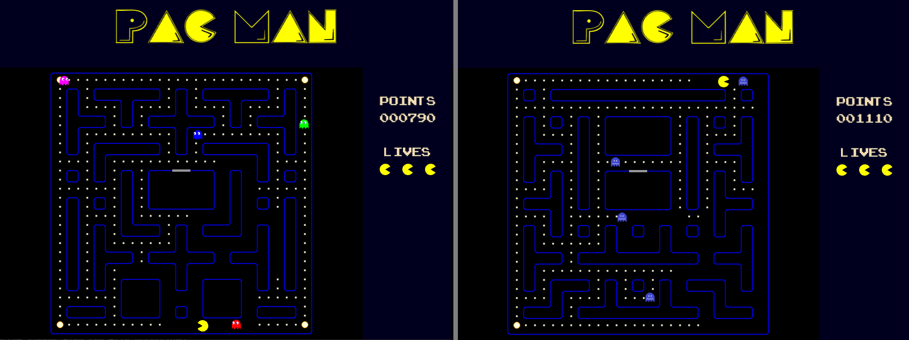

# PacMan

## Author: Kacper Budnik

### Short description
---
A copy of the cult game - PacMan, with randomly generated map and functionality to change basic settings such as ghost speed and their number ,map size and much more!

### Technologies
---
**Python** - the whole code was written in Python.

**Python Arcade Library** - modern Python Module used widely for developing 2D video games with compelling graphics and sound. 

**Gimp**  - for creating images.

### License
---
The whole project is created solely for educational purposes. 

### How to run this app?
---
To run the game through interpreter, **Python 3.9.5** is recommended. Following the steps below use also eg **pip 21.1.2**.

1. Clone the project to your device:

    `git clone  https://github.com/KacperBudnik/Pac-Man.git Pac-Man`

    `cd Pac-Man`
2. Install the project's development and runtime requirements:

    `pip install -r requirements.txt`
3. Run the game:

    `python Pac-Man`